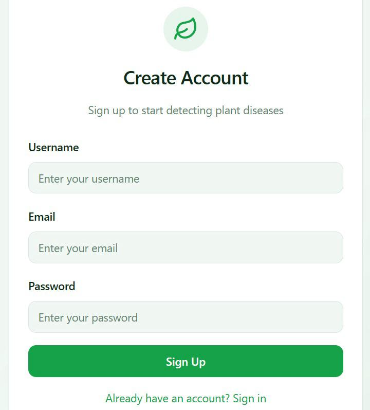
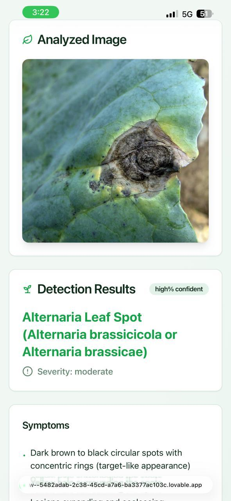
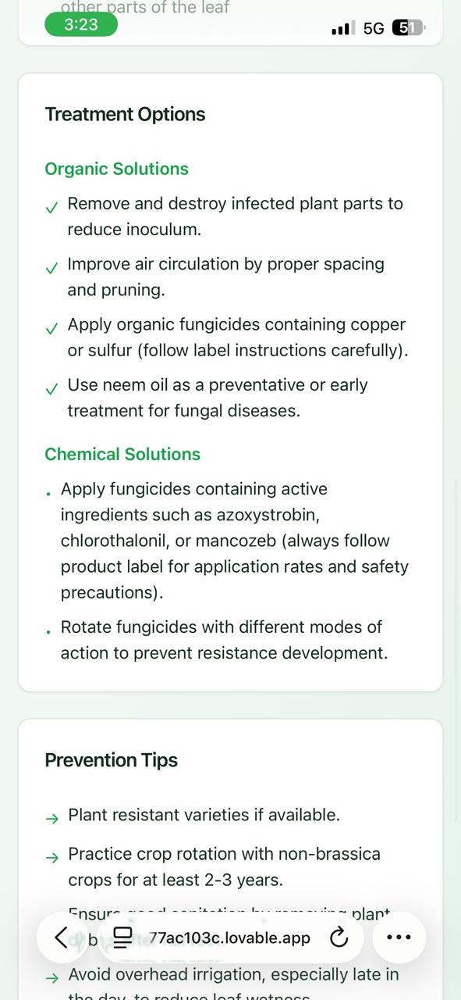

# Plant Disease Detection System

A modern web application for detecting plant diseases using AI-powered image analysis. Capture photos with your mobile device or Raspberry Pi camera and get instant disease diagnosis with treatment recommendations.

## Features

- 📱 **Mobile-First Design**: Optimized for smartphones and tablets
- 🤖 **AI-Powered Analysis**: Real-time disease detection using advanced AI models
- 📷 **Camera Integration**: Support for mobile cameras and Raspberry Pi USB cameras
- 🔒 **Secure Authentication**: User accounts with secure data storage
- 📊 **Detailed Reports**: Comprehensive analysis with confidence scores and treatment suggestions
- 🌐 **Offline Capable**: Core functionality works without internet connection

## Tech Stack

### Frontend
- **React 18** with TypeScript
- **Vite** for fast development and building
- **Tailwind CSS** for styling
- **shadcn/ui** component library
- **React Router** for navigation
- **TanStack Query** for data management

### Backend
- **Supabase** for database and authentication
- **PostgreSQL** with Row Level Security
- **Edge Functions** for serverless API
- **Python Flask** for Raspberry Pi camera server

### Hardware Integration
- **Raspberry Pi** with camera module
- **USB Camera Support**
- **CSI Camera Support**

## Quick Start

### Prerequisites
- Node.js 18+ and npm
- Raspberry Pi (optional, for camera server)
- USB Camera or CSI Camera (optional)

### Installation

1. **Clone the repository**
   ```bash
   git clone <YOUR_GIT_URL>
   cd plant-disease-detection
   ```

2. **Install dependencies**
   ```bash
   npm install
   ```

3. **Configure environment variables**
   ```bash
   cp .env.example .env.local
   # Edit .env.local with your configuration
   ```

4. **Start development server**
   ```bash
   npm run dev
   ```

### Raspberry Pi Camera Setup

For full functionality with hardware camera:

1. **Setup USB Camera on Raspberry Pi**
   ```bash
   chmod +x server/setup-usb-camera.sh
   ./server/setup-usb-camera.sh
   ```

2. **Configure Camera Server**
   ```bash
   cd server
   cp .env.example .env
   # Edit .env with your camera settings
   npm install
   npm start
   ```

3. **Update web app configuration**
   ```bash
   # In .env.local, set your Pi's IP
   VITE_CAMERA_SERVER_URL=http://YOUR_PI_IP:3001
   ```

## Project Structure

```
├── src/
│   ├── components/     # Reusable UI components
│   ├── pages/         # Application pages
│   ├── hooks/         # Custom React hooks
│   ├── lib/           # Utility functions
│   └── integrations/  # External service integrations
├── server/            # Raspberry Pi camera server
├── supabase/          # Database migrations and functions
└── public/            # Static assets
```

## API Documentation

### Disease Detection
- **Endpoint**: `/functions/v1/detect-disease`
- **Method**: POST
- **Body**: FormData with image file
- **Response**: Disease analysis with confidence scores

### Camera Server
- **Endpoint**: `/api/capture`
- **Method**: GET
- **Response**: Base64 encoded image

## Deployment

### Web Application
```bash
npm run build
npm run preview
```

### Camera Server (Raspberry Pi)
```bash
cd server
npm run build
npm start
```

## Contributing

1. Fork the repository
2. Create a feature branch
3. Make your changes
4. Add tests if applicable
5. Submit a pull request

## License

This project is licensed under the MIT License - see the LICENSE file for details.

## Support

For questions or issues, please open an issue on GitHub or contact the development team.

## 🖼️ Screenshots








...